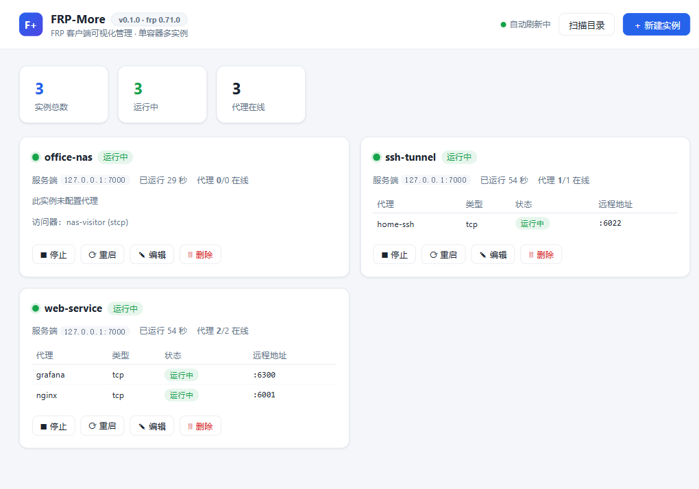

# FRP-More

可视化的 FRP 客户端（frpc）管理面板：**一个容器内运行多个 frpc 实例**，通过网页统一管理配置、启停和状态监控。

基于 [fatedier/frp](https://github.com/fatedier/frp) v0.71.0 的 Go 库内嵌实现（非 exec 子进程），实例的启动、停止、状态采集全部在进程内完成。



## 功能

- **多实例管理**：每个 `frpc.toml` 配置文件对应一个独立实例，一个进程/容器内可同时运行任意多个（典型场景：2~3 个不同服务端/用途的配置）
- **可视化页面**：实例卡片展示运行状态、已运行时长；每个代理的在线状态与远程端口实时刷新（4 秒轮询）
- **在线编辑配置**：页面内直接编辑 TOML 配置，保存时做完整校验（与 frpc 严格模式一致），运行中的实例保存后自动重启生效
- **实例生命周期**：启动 / 停止 / 重启 / 删除；「已停止」状态持久化到 `data/state.json`，容器重启后保持
- **实例日志**：每个实例独立保留最近 200 行日志，使用唯一实例标记严格隔离；同时保留全局日志用于排查跨实例问题
- **目录扫描**：手动把 `.toml` 文件放进数据目录后，点「扫描目录」（或 `POST /api/reload-dir`）即可发现并启动
- **校验前置**：非法配置（未知字段、缺字段、端口冲突等）在保存时即被拒绝，不会影响正在运行的实例

## 快速开始（Docker）

Linux 服务器一键部署（拉取 GHCR 镜像 + 初始化配置目录 + 启动容器）：

```bash
curl -fsSL https://raw.githubusercontent.com/JuZiool/frp-more/main/install.sh | bash
```

可选环境变量：`FRP_MORE_PORT`（管理端口，默认 1332）、`FRP_MORE_DIR`（数据目录，默认 `/opt/frp-more`）、`FRP_MORE_VERSION`（镜像版本，默认 `latest`）、`FRP_MORE_USERNAME`（登录用户名，默认 `admin`）、`FRP_MORE_PASSWORD`（登录密码，默认 `admin123`）。

手动部署：

```bash
docker compose up -d
# 或直接使用已发布的镜像：
docker run -d --name frp-more --network host \
  -e FRP_MORE_USERNAME=admin -e FRP_MORE_PASSWORD=admin123 \
  -v /opt/frp-more:/data --restart unless-stopped \
  ghcr.io/juziool/frp-more:latest
```

打开 <http://localhost:1332>，使用默认账号登录：

```text
用户名：admin
密码：admin123
```

登录后即可点击「新建实例」，填入名称和 frpc 配置。配置持久化在 `./data/instances/*.toml`。
生产环境建议通过 `FRP_MORE_USERNAME` 和 `FRP_MORE_PASSWORD` 修改默认账号密码。

默认使用 **host 网络模式**（`network_mode: host`）：管理页面直接监听宿主机 `:1332`，实例的 `localIP` 也可以直接写内网 IP 或 `127.0.0.1`。需要更换管理端口时，取消 compose 中 `command` 的注释并调整端口。

Windows Docker Desktop 可使用仓库中的覆盖配置：

```bash
docker compose -f docker-compose.yml -f docker-compose.windows.yml up -d --build
```

### 让 frpc 访问内网服务

- **Linux 宿主机（默认 host 模式）**：无需额外配置，`localIP` 直接写 `127.0.0.1` 或内网 IP。
- **Docker Desktop（Windows/macOS）或无法用 host 网络**：注释掉 compose 里的 `network_mode: host`，启用 `ports: ["1332:1332"]` 端口映射；此时 `localIP` 要写 Docker 网络内可达的地址，访问宿主机服务用 `host.docker.internal`。

## 飞牛 fnOS 原生安装（无需 Docker）

提供 fnOS 应用包（fpk，x86_64），以原生进程运行，不依赖 Docker：

1. 从 [Releases](https://github.com/JuZiool/frp-more/releases) 下载 `frp-more-x.y.z.fpk`
2. fnOS 应用中心 → 设置 → **手动安装应用**，选择 fpk 文件
3. 安装后桌面出现 FRP-More 图标，点击进入管理页面（监听 `1332` 端口）
4. 实例配置持久保存在应用数据目录（`var/`），升级、重启不丢失；应用中心可直接启动/停止服务

打包方式：`./fnos/build.sh <版本号>`（需安装 [fnpack](https://developer.fnnas.com/docs/cli/fnpack/)），发布流水线会在打 tag 时自动构建并附加到 Release。

## 本地开发（不用 Docker）

需要 Go ≥ 1.25：

```bash
go build -o frp-more .
./frp-more -data ./data -addr :1332
```

## 实例配置示例

```toml
serverAddr = "your-frps-host"
serverPort = 7000
auth.token = "your-token"

# 连接失败后保持重试，便于服务端恢复后自动重连（推荐保留）
loginFailExit = false

[[proxies]]
name = "web"
type = "tcp"
localIP = "192.168.1.100"
localPort = 8080
remotePort = 6001
```

支持 frpc 全部配置项（TOML 格式），参考 [frp 官方文档](https://github.com/fatedier/frp/blob/dev/README_zh.md)。

## REST API

| 方法 | 路径 | 说明 |
|---|---|---|
| GET | `/api/instances` | 实例列表（含每个代理的实时状态） |
| POST | `/api/instances` | 创建实例 `{name, config}`，校验通过后自动启动 |
| GET | `/api/instances/{name}/config` | 读取实例配置原文 |
| GET | `/api/instances/{name}/logs` | 读取该实例的独立日志（最近 200 行） |
| PUT | `/api/instances/{name}/config` | 更新配置（校验 + 运行中自动重启） |
| POST | `/api/instances/{name}/start` | 启动 |
| POST | `/api/instances/{name}/stop` | 停止（状态持久化） |
| POST | `/api/instances/{name}/restart` | 重启 |
| DELETE | `/api/instances/{name}` | 删除实例及配置文件 |
| POST | `/api/reload-dir` | 重新扫描数据目录 |
| GET | `/api/logs` | 读取全局日志（最近 200 行） |
| POST | `/api/login` | 登录 `{username, password}` |
| GET | `/api/session` | 查询当前登录状态 |
| POST | `/api/logout` | 退出登录 |
| GET | `/api/version` | 版本信息（无需登录） |

## 架构

```
┌──────────────── frp-more 容器 ────────────────┐
│  管理页面 (静态 SPA)  ←→  REST API (:1332)     │
│                              │                │
│                     Manager 实例管理器         │
│               ┌───────────┼───────────┐      │
│         client.Service × N（goroutine 内嵌）   │
│  /data/instances/{a,b,c}.toml  ← volume 挂载  │
└───────────────────────────────────────────────┘
```

- 每个实例按 frpc 官方启动流程加载配置（load → aggregate → filter → validate），跑在独立的 goroutine 里，互不影响；一个实例崩溃或登录失败退出不影响其他实例
- 代理状态通过 frp 库的 `StatusExporter` 在进程内直接读取，无需为每个实例开 admin 端口
- 日志同时输出到 stdout 和管理页面；全局日志可用 `docker logs frp-more` 查看，实例日志可在对应实例卡片中查看
- 默认使用 debug 日志级别，可通过 `--log-level trace|debug|info|warn|error` 调整

## 已知限制

- frp 的 `client` 包属于内部 API（无稳定性承诺），本项目锁定 v0.71.0；升级 frp 版本需要回归测试
- FRP 库内部使用全局 logger；本项目为每个嵌入式服务注入唯一实例标记，只有带该标记的日志才会写入对应实例。没有实例标记的通用日志仅显示在全局日志中
- 数据目录仅识别 `.toml` 格式（frp 亦支持 yaml/json，如有需要可扩展）

## 项目结构

```
frp-more/
├── main.go                      # 入口：初始化 manager + HTTP 服务
├── internal/
│   ├── manager/manager.go       # 实例生命周期 / 状态采集 / 目录扫描 / 持久化
│   ├── server/server.go         # REST API + 嵌入式静态页面
│   └── server/static/index.html # 管理页面（单文件，无外部依赖）
├── install.sh                   # 一键部署脚本（拉镜像 + 初始化配置）
├── fnos/                        # 飞牛 fnOS 原生应用包（fpk）打包目录
│   ├── manifest / config/       # 包元信息与权限声明
│   ├── cmd/                     # 安装/启停/卸载生命周期脚本
│   ├── app/ui/config            # 桌面入口（应用卡片打开网页）
│   └── build.sh                 # fpk 构建脚本
├── .github/workflows/docker.yml # 打 tag 自动构建镜像(GHCR) + fpk 并附到 Release
├── Dockerfile                   # 两阶段构建（golang → alpine）
├── docker-compose.yml
└── data/                        # 运行时数据（instances/*.toml、state.json）
```

## 许可证

[Apache-2.0](LICENSE)。本项目内嵌并分发 [fatedier/frp](https://github.com/fatedier/frp)（Apache-2.0）。

